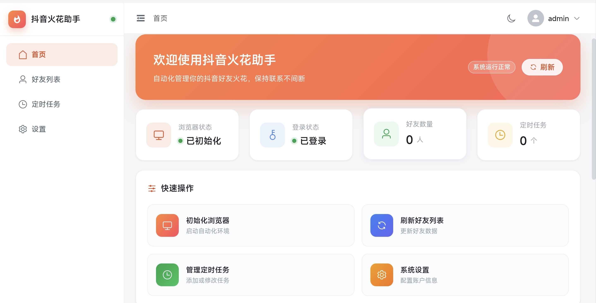
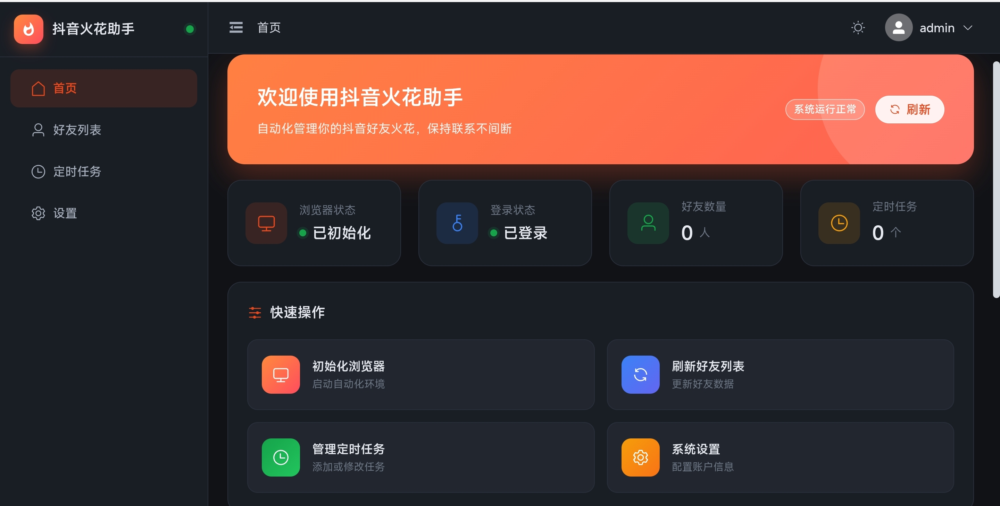

# 抖音火花助手（TikTok Spark Auto Web For Docker）

抖音火花助手 Web 管理平台，基于 Vue 3 + Element Plus 构建，提供抖音好友火花自动续期的可视化管理系统。本改版推荐使用 Docker 部署，其他部署方式暂未验证。



# 免责声明

**封号风险警告**：本项目通过自动化方式操作抖音（登录、发消息、定时续火花等），**可能违反抖音的服务条款并触发风控**，存在账号被限制、甚至封禁的风险。使用本工具所产生的任何后果（含账号损失）均由使用者自行承担，与原作者及本仓库维护者无关。

---

## 默认信息

| 项目 | 默认值 | 说明 |
|------|--------|------|
| 后台账户 | `admin` / `123456` | 登录管理后台使用 |
| VNC 密码 | `123456` | Docker 部署时连接 VNC 使用 |

> ⚠️ **默认密码提醒**：以上均为默认密码，仅便于演示/首次使用。
> 正式使用前请务必修改：管理员密码在后台「设置 → 修改密码」；VNC 密码在 `docker-compose.yml` 的 `VNC_PASSWORD`。

## 功能特性

### 账户管理
- 扫码登录（抖音 App 扫码授权）
- 手机号登录
- 手动登录（Base64Cookie 方式）
- Cookie 一键导出
- 登录状态实时监测
- 上次登录 IP 记录
- 管理员密码修改

### 好友管理
- 好友列表展示（头像、火花天数）
- 好友搜索过滤
- 实时刷新好友数据
- 一键发送消息

### 定时任务
- 为好友创建每日定时发送任务
- 支持自定义消息内容（留空使用每日名言）
- 修改已有任务执行时间
- 删除定时任务
- 最近任务快捷入口

### 首页看板
- 浏览器/登录状态监测
- 好友数量 / 定时任务数量统计
- 快速操作入口
- 系统运行信息（版本、在线时长）

### 界面预览（亮色 / 暗色）

首页看板支持**亮色与暗色模式**，右上角图标一键切换：



---

## 技术栈

| 层级 | 技术 |
|------|------|
| 前端框架 | Vue 3 (Composition API) |
| UI 组件库 | Element Plus |
| 状态管理 | Pinia |
| 构建工具 | Vite |
| 路由 | Vue Router |
| HTTP 客户端 | Axios |
| 后端 | FastAPI + Selenium（Chromium） |

---

## 项目结构

```
.
├── src/                        # 前端源码（Vue3 + Element Plus）
│   ├── api/douyin.js           # API 接口封装
│   ├── components/             # 公共组件（FlameIcon 等）
│   ├── router/index.js         # 路由配置
│   ├── stores/                 # 状态管理（user / browser）
│   ├── utils/format.js         # 好友列表格式化
│   ├── views/                  # 页面（Home/Friends/Tasks/Settings/Login/NotFound/Layout）
│   ├── App.vue
│   ├── main.js
│   ├── config.js               # 全局配置（支持 VITE_* 环境变量注入）
│   └── style.css
├── public/                     # 静态资源（favicon 等）
├── docker/                     # 容器脚本（entrypoint / nginx / noVNC）
├── 抖音自动续火花-后端.py       # FastAPI 后端
├── Dockerfile                  # 镜像构建（前端 + 后端 + Chromium + VNC 一体）
├── docker-compose.yml          # 一键编排（含 noVNC 网页版 VNC）
├── DEPLOY.md                   # 详细部署文档（Windows / Linux / Docker）
├── vite.config.js              # 前端构建与 /api 代理配置
├── package.json
└── requirements.txt
```

---

## Docker 部署（推荐 · 含 VNC 二次验证）

> 一切依赖（Chromium / chromedriver / Xvfb / VNC / 后端 / 前端）全部打包进容器，
> **宿主机无需安装任何浏览器或驱动**，不会污染服务器。

### 部署方式（三选一）

```bash
# 方式一：docker compose 部署（推荐）
docker compose up -d

# 方式二：从镜像仓库拉取镜像
docker pull gxyzdg/tiktok-spark-auto-web-for-docker:latest
docker compose up -d

# 方式三：导入本地镜像包（推荐 · 适合离线 / 内网分发）
docker load -i tiktok-spark-latest.tar.gz
docker compose up -d
```

### 快速上手（5 步）

1. **启动容器**：`docker compose up -d`（推荐方式，见上方「部署方式」）
2. **打开管理后台**：浏览器访问 `http://<服务器IP>:14320/`，登录账户 `admin` / `123456`
3. **初始化浏览器**：进入首页点「初始化浏览器」（容器内已内置 Chromium）
4. **登录抖音**：在「设置」页扫码 / 验证码 / Base64Cookie 任选其一登录
5. **添加定时任务**：在「定时任务」页为好友设置每日发送时间，自动续火花

### 端口说明

| 端口 | 用途 |
|------|------|
| `14320`（默认） | 前端页面（`/api` 已自动反代到后端）——日常访问主入口 |
| `14321`（默认） | noVNC **网页版** VNC：浏览器直接访问 `http://IP:14321/` 即可看到抖音窗口，无需安装 VNC 客户端 |
| `5900` | VNC（任意 VNC 客户端连接，用于**手动完成二次验证**：接收手机验证码 / 扫码人脸识别） |

> 端口全部可自定义：前端用 `WEB_PORT`、noVNC 用 `NOVNC_PORT`、后端用 `API_PORT`。
> 改完端口映射后，把同名环境变量也设成一样的值，首页显示的「前端端口 / API 地址 / noVNC 端口」会自动跟随，**不需要重新构建镜像**（前端端口本身取自浏览器地址栏）。
| `9844` | 后端 FastAPI——**默认不对宿主机映射**（普通使用不需要；调试时按需打开映射） |

> 默认端口为 **14320（前端）/ 14321（noVNC）**，都在非常用端口段，避免和服务器上其它服务冲突；
> 可用环境变量 `WEB_PORT` / `NOVNC_PORT` 任意修改（如 `WEB_PORT=3000 docker compose up -d`）。
> 默认只映射前端与 noVNC 两个端口，**宿主机防火墙/云安全组放行** `14320`、`14321` 即可。
> 后端 `9844` 与 VNC `5900` 默认不出容器（需要直连调试/用 VNC 客户端时再自行打开映射）。
> `5900` 为 VNC 明文通道，请勿暴露到公网，建议内网使用或改 `127.0.0.1:5900` 绑定 + SSH 隧道。

**VNC 使用**：密码默认 `123456`（在 `docker-compose.yml` 的 `VNC_PASSWORD` 修改，**正式使用前请务必修改**）。
推荐直接用网页版：浏览器打开 `http://<服务器IP>:14321/`；也可用任意 VNC 客户端连接 `:5900`（需自行打开映射）。

> 适用场景：扫码登录后抖音会要求二次验证（接收手机验证码 / 扫码人脸识别），原项目无法自动化这一步，
> 需要在 VNC 窗口（或登录向导的画面里）手动完成（抖音窗口为标准横版 1280x720，可拖动；按钮均可直接操作）。

**数据持久化**：定时任务（`tasks.json`）与管理员密码（`config.json`）保存在命名卷 `spark-tasks`（`/data/`），重建容器不丢失。

---

## 本地开发（可选 · 非 Docker 部署）

> 以下为在宿主机直接运行的方式，仅本地开发/调试使用；**推荐优先使用上方 Docker 部署**。

### 环境要求
- Node.js >= 20.19（Vite 8 要求，建议使用 Node 22 LTS）
- Python 3.8+（后端服务）
- Chrome / Chromium（自动化依赖）

### 安装依赖

```bash
# 在项目根目录执行
npm install
pip install -r requirements.txt
```

### 开发模式

```bash
npm run dev
```

访问 `http://localhost:5173`，开发服务器会自动代理 `/api` 请求到后端。

### 生产构建

```bash
npm run build
```

产物输出到 `dist/` 目录，可部署至任意静态服务器。

---

## 后端环境变量（本地部署可选）

后端基于 **Chromium / Chrome** 自动化，本地部署时可用环境变量调整：

| 变量 | 说明 | 默认值 |
|------|------|--------|
| `HOST` | uvicorn 监听地址 | `localhost` |
| `PORT` | uvicorn 监听端口 | `9844` |
| `CHROME_DRIVER_PATH` | chromedriver 绝对路径；留空时由 Selenium Manager 自动匹配下载 | 空（自动） |
| `SHOW_BROWSER` | 设为任意非空值（如 `1`）则显示浏览器窗口；默认无头模式 | 空（无头） |
| `SCALE_FACTOR` | 页面缩放系数：`1`（标准横版窗口，清晰可读） | `1` |
| `TASKS_FILE` | 定时任务持久化文件 | 脚本同目录 `tasks.json` |
| `CONFIG_FILE` | 管理员密码持久化文件 | 脚本同目录 `config.json` |

> Docker 部署无需配置以上任何变量（镜像已内置默认值）；仅本地部署按需设置。

启动示例（Linux 无头部署）：

```bash
export CHROME_DRIVER_PATH=/usr/local/bin/chromedriver   # 可选，留空则自动下载
export PORT=9844
python3 抖音自动续火花-后端.py
```

Windows 可在命令行设置：

```powershell
set CHROME_DRIVER_PATH=C:\path\to\chromedriver.exe
set PORT=9844
python 抖音自动续火花-后端.py
```

> 需要先安装 Chromium/Chrome（Linux：`sudo apt install chromium` 或安装 Chrome；Windows：安装 Chrome 即可）。

---

## API 代理配置

开发环境下 Vite 自动将 `/api` 代理至后端（`vite.config.js`）；生产环境（本地部署）用 Nginx 等反代即可：
```nginx
        location / {
            try_files $uri $uri/ /index.html;   # history 路由回退
        }
        location /api/ {
            proxy_pass http://127.0.0.1:9844/;  # 去 /api 前缀转发，与后端路由匹配
            proxy_set_header Host $host;
            proxy_set_header X-Real-IP $remote_addr;
            proxy_set_header X-Forwarded-For $proxy_add_x_forwarded_for;
            proxy_connect_timeout 60s;
            proxy_read_timeout 120s;   # 发消息/初始化/截图较慢，超时给足
        }
```

> 后端默认端口为 `9844`，请确保 FastAPI 后端已启动并监听该端口。

---

## 页面路由

| 路径 | 页面 | 说明 |
|------|------|------|
| `/login` | 登录页 | 管理员账户登录 |
| `/home` | 首页 | 状态看板、快速操作 |
| `/friends` | 好友列表 | 查看好友、发送消息 |
| `/tasks` | 定时任务 | 添加/修改/删除任务 |
| `/settings` | 设置 | 登录管理、密码修改 |

---

## 开源协议与二次发布说明

本项目基于上游仓库 **[DkoBot/TikTokAutoSparkWeb](https://github.com/DkoBot/TikTokAutoSparkWeb)** fork 后进行二次开发。

- **开源协议**：MIT License（详见 `LICENSE.txt`），原始版权归 **CNFsToT（© 2026）** 所有。
- **MIT 允许**：自由使用、复制、修改、合并、发布、分发、再许可，甚至商用，**但必须保留原始版权声明**（`LICENSE.txt` 中的 `Copyright (c) 2026 CNFsToT` 及完整 MIT 许可文本）。
- **本仓库的二次开发内容**（Docker 部署、VNC、多平台支持、安全修复、前端重构等）同样基于 MIT 授权，可随项目自由分发。
- 若你在此基础上继续二次发布，请保留上述版权声明；建议同时追加你自己的版权行：
  ```
  MIT License
  Copyright (c) 2026 CNFsToT
  Copyright (c) 2026 你的名称
  ```

### 免责声明与侵权处理（请务必阅读）

1. **仅供个人学习与研究使用**，请遵守当地法律法规及平台规则，不得用于任何违法或侵权用途。
2. 程序按 MIT 协议以「现状」（AS IS）提供，不附带任何明示或默示担保。
3. **侵权问题**：本项目一切代码与资源均基于 MIT 授权；如您认为本仓库内容侵犯了您的权益，请联系原作者或本仓库维护者处理，我们将在核实后第一时间处理。
